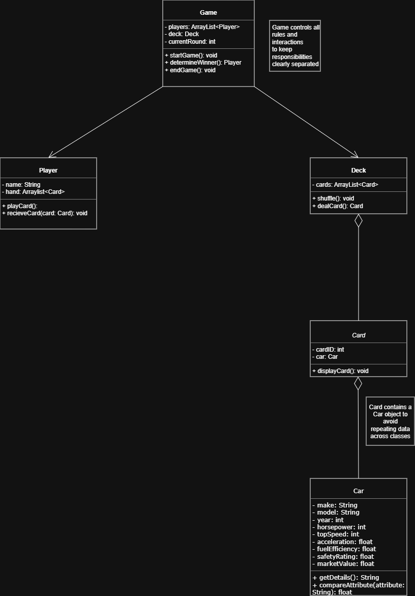

# Part C – Class Diagram

## UML Class Diagram

## Design Decisions

**Design Decision 1**
Card contains a Car object rather than repeating data across classes. This keeps the design clean and follows object-oriented principles.

**Design Decision 2**
Game controls all rules and interactions to keep responsibilities clearly separated between classes.